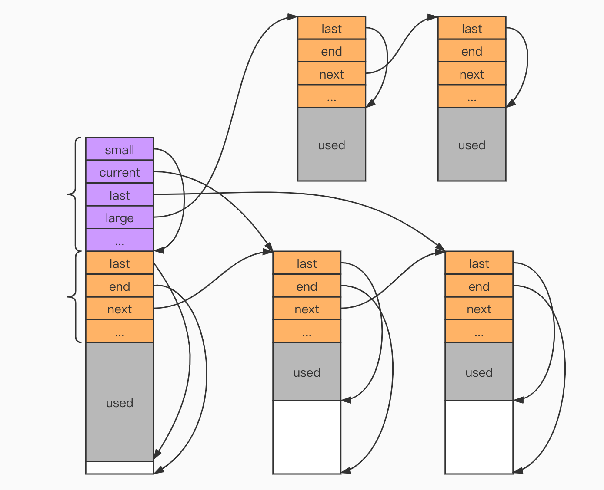

[TOC]

内存池
---

# 数据结构
```
struct isshe_mempool_data_s
{
    isshe_uchar_t           *last;      // 指向已使用的内存的最后
    isshe_uchar_t           *end;       // 指向整块内存的最后
    isshe_mempool_data_t    *next;      // 下一块内存
    isshe_int_t             failed;     // 失败计数
};


struct isshe_mempool_s {
    isshe_size_t                max;            // 以此值区分small/large
    isshe_mempool_data_t        *small;         // 用于小块内存分配的链表
    isshe_mempool_data_t        *current;       // 指向当前可用的小块内存池
    isshe_mempool_data_t        *last;          // 指向最后一个小块内存，为了减少遍历
    isshe_mempool_data_t        *large;         // 大块内存，直接从系统分配内存，采用头插
    isshe_log_t                 *log;
};
```

# 内存布局


# 内存分配策略
* 判断需要的内存是大块内存，还是小块内存。
* 大块内存：直接从系统malloc，然后链接到`large`下面。
* 小块内存：
    * 从`current`开始遍历，查找是否存在可以容纳的内存块。
    * 存在，则直接分配。
    * 不存在，则新建一个内存块，再继续分配。
    * `isshe_mempool_data_t`中使用`failed`计算分配这块内存的分配失败次数.
        * 如果`failed >= 阈值`(如`5`)，则判断此内存块已满，`current`指针移动到小于阈值的内存块。

# 内存释放策略
* 判断是想要释放的是大块内存还是小块内存。
* 小块内存：不进行释放，直接返回。
* 大块内存：遍历`large`进行查找释放。